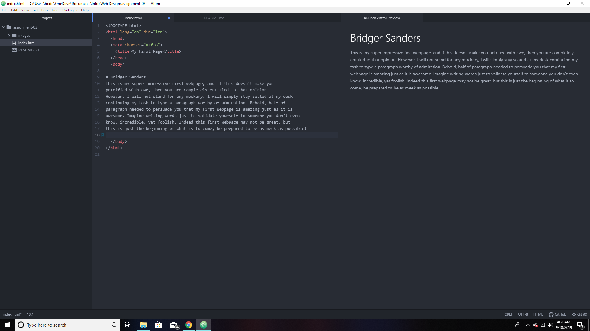

13. Very briefly detail how browsers function. List any browsers you currently use to surf - or even develop for - the web.
- A browser is what is used to display the internet's contents on the user interface.
Browsers make use of a rendering engine, browser engine, and interpreter to translate markup languages and files for display.
- I usually use Google Chrome as my browser.  

14. What is a markup language? Describe one commonly used in development.
- A markup language is what's used to display texts and certain things on a
browser. HTML is the most common and renowned markup language, it's utilized
for it ability to construct the template of a page's content.

15. An embedded image of your screenshot using its relative URL.

