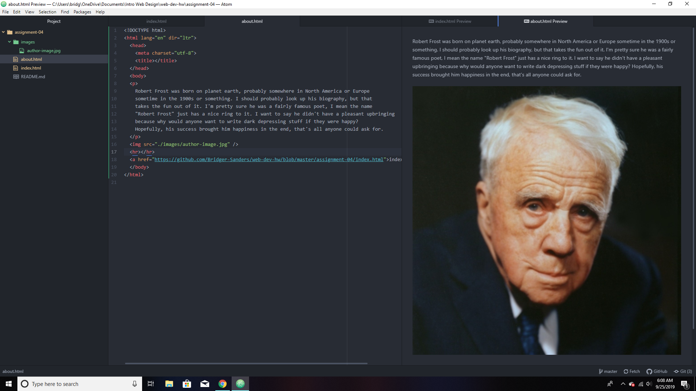

13. Visit a site using The Wayback Machine, looking at a snapshot at least 10 years old.
Where did you go? What did it look like? How has it changed?

- I went to Reddit back in September 2009, the webpage seemed more flat than it does now.
It was less aesthetic to look at, it probably wouldn't be user friendly to those who never
used reddit before. Today, Reddit feels and looks a lot better, corners are rounded,
colors and alignment flow nicely, and the names of users and subs have larger fonts
and are at the top of posts.

14. Summarize your experience with the GIT Module. What did you learn? What was difficult, easy, or still misunderstood?

- I learned how to format my files and how to link things in html. Everything seemed easy enough,
however I couldn't seem to make preformatted text to work, so I just stuck with a standard paragraph.

15. 
